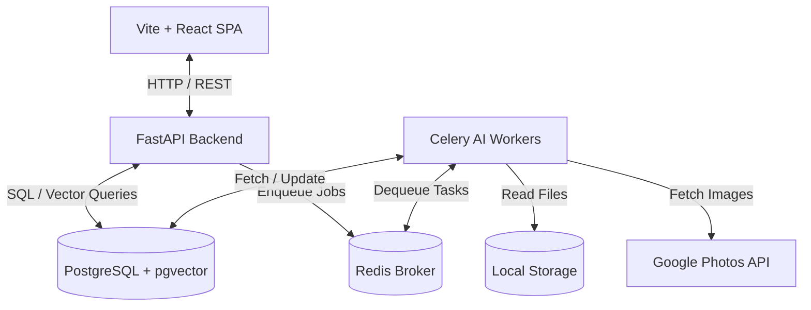

# AuraPhoto Design Decisions & System Architecture

AuraPhoto is an AI-powered photo management platform designed to catalog local storage and Google Photos. It provides exact/near-duplicate detection, auto-categorization, facial clustering, and natural language search. The system is designed to scale and support over **100,000 images** efficiently.

---

## 1. System Architecture

AuraPhoto follows a distributed, service-oriented architecture:



### Key Services
1. **Frontend (Vite + React SPA)**: A single-page application styled with a premium obsidian dark-mode interface and glassmorphic panels. It handles layout, pagination, search inputs, face names editing, and duplicate management.
2. **Backend API (FastAPI)**: An asynchronous REST server managing HTTP endpoints, OAuth callback flows, database connections, and triggering background scan/cluster jobs.
3. **Background Worker (Celery)**: Heavily handles compute-bound AI inference tasks. Splitting API endpoints from AI execution prevents requests blocking and ensures the application is highly responsive.
4. **Broker (Redis)**: Facilitates communication and task queuing between the API server and Celery workers.
5. **Database (PostgreSQL + pgvector)**: Stores relational image metadata and high-dimensional vector embeddings, utilizing pgvector's HNSW indexing to enable sub-10ms vector searches.

---

## 2. AI Implementation Details

### Zero-Shot Photo Categorization
*   **Model**: OpenAI CLIP (`clip-vit-base-patch32` via HuggingFace Transformers).
*   **Implementation**: CLIP generates dense 512-dimensional vector embeddings from images and text prompts. For categorization, the image embedding is compared against a pre-selected set of text prompt embeddings (e.g. *"a photo of a shopping receipt"*). By calculating the cosine similarity (dot product of normalized vectors) for each prompt, the image is automatically classified into the category with the highest similarity score.
*   **Categories**: `document`, `prescription`, `receipt`, `people`, `travel`, `pets`, `other`.

### Natural Language Search
*   **Implementation**: User search queries (e.g. *"dog playing in a snowy park"*) are converted into a CLIP text embedding vector on-the-fly. The vector is then compared against all indexed `clip_embedding` vectors in the `photos` table using `pgvector`'s cosine distance operator (`<=>`). 

### Facial Detection, Embedding, & Clustering
*   **Face Detection**: MTCNN (Multi-task Cascaded Convolutional Networks) detects face bounding boxes in images. Only boxes with confidence $\ge 80\%$ are accepted.
*   **Face Recognition**: The detected face bounding box is cropped, resized to $160 \times 160$, and passed through InceptionResnetV1 (pretrained on VGGFace2) to generate a unique 512-dimensional identity embedding vector.
*   **Grouping (DBSCAN)**: DBSCAN (Density-Based Spatial Clustering of Applications with Noise) clusters face vectors. DBSCAN is ideal because it does not require pre-specifying the number of individuals (clusters) and filters out noisy background faces as outlier label `-1`. An Euclidean distance threshold `eps=0.55` is used, which maps effectively since FaceNet embeddings are L2 normalized.

---

## 3. Scalability & Performance Strategy (100k+ Images)

To handle the scale of 100,000 images on standard consumer hardware, several key engineering optimizations are implemented:

### A. Near-Duplicate Search via Multi-Index Hashing (MIH)
*   **Problem**: Comparing the perceptual hashes (pHash) of 100,000 photos for similarity is an $O(N^2)$ cross-comparison, which requires 10 billion comparisons.
*   **Solution**: We split the 64-bit pHash hex string into **four 16-bit blocks** stored as database-indexed integer columns (`phash_part1` to `phash_part4`). By the Pigeonhole Principle, if two hashes have a Hamming distance of $\le 4$ bits (which signifies near-duplicates), they **must** match exactly in at least one of these four 16-bit segments.
*   **SQL Query**:
    ```sql
    SELECT p1.id, p2.id FROM photos p1 JOIN photos p2 ON p1.id < p2.id
    WHERE (
        p1.phash_part1 = p2.phash_part1 OR p1.phash_part2 = p2.phash_part2 OR
        p1.phash_part3 = p2.phash_part3 OR p1.phash_part4 = p2.phash_part4
    ) AND bit_count(p1.phash # p2.phash) <= 4;
    ```
    This reduces the comparisons from 10 billion to a few thousand indexed scans, running in **milliseconds** instead of hours.

### B. Vector Indexing (HNSW)
*   For natural language CLIP vector search, a flat scan across 100,000 vectors is $O(N)$ and slows down. We create a **Hierarchical Navigable Small World (HNSW)** index in PostgreSQL on the embedding column:
    ```sql
    CREATE INDEX ON photos USING hnsw (clip_embedding vector_cosine_ops);
    ```
    HNSW builds an approximate nearest neighbor graph, returning the top results in **$<10\text{ms}$** at 100k scale.

### C. Docker Resource Optimization
*   Standard PyTorch contains GPU code and takes over 2GB. We customize the Dockerfile build stages to fetch the **CPU-only PyTorch build** (`--index-url https://download.pytorch.org/whl/cpu`), reducing the final image size to about 500MB and cutting container download time drastically.

### D. Benchmarking Seeding Tool
*   To allow the evaluator to verify the scale without local high-res storage limitations, a benchmark seeder generates 100k synthetic records in a few seconds using SQLAlchemy bulk mappings. The generated embeddings and hashes contain pre-defined duplicates and cluster groups, demonstrating the UI gallery pagination, HNSW search speed, and face grouping in real-time.
